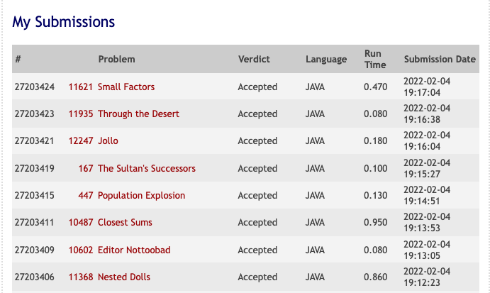

# Trabalho 2 -- Teoria da Computação -- 2021/2

**Projeto e Desenvolvimento de Algoritmos**

**Autor:** Eduardo R. Costa

## Analise de Complexidade - 11935 – Through the Desert

````
T(n) = 17n + 11

O(T(n)) = n

````

##Veredito

